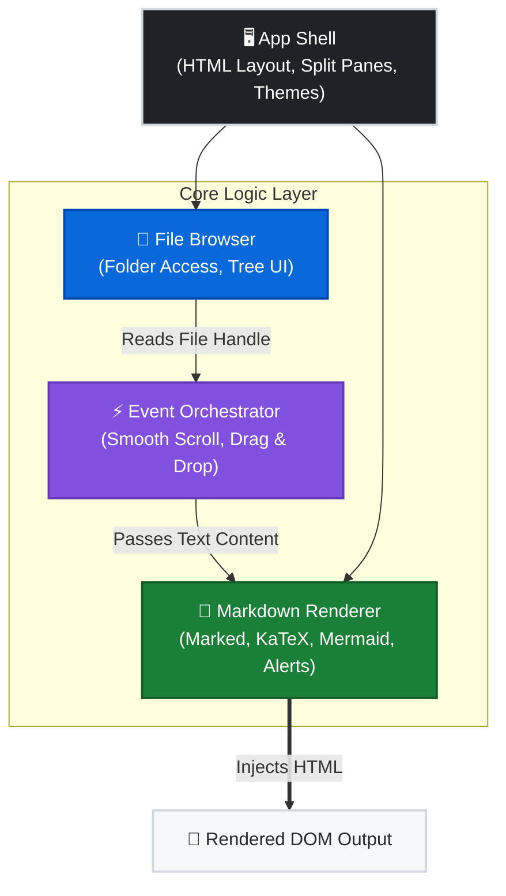

# 📑 MD Browser
### The ultimate zero-setup, offline-first Markdown viewer for your local documentation.

  

 A lightweight, purely client-side tool designed to help you browse and read local Markdown documentation with ease. It transforms a folder of `.md` files into a professional, GitHub-style documentation site instantly—no servers, no build steps, and no internet required.

### 🌟 Why MD Browser?
- **Zero Configuration**: No `npm install`, no local server. Just open `md-browser.html` and start reading.
- **Live Preview**: Watch your documentation update in real-time as you save files in your favorite editor.
- **Professional Rendering**: Built-in support for Mermaid diagrams, KaTeX math, and GitHub-style Alerts.
- **Privacy First**: Your files never leave your computer. All processing happens 100% locally in your browser.

## 📋 Table of Contents
- [🚀 Getting Started](#-getting-started)
- [✨ Features](#-features)
- [🤖 AI‑Generated Code Disclaimer](#-aigenerated-code-disclaimer)
- [🧱 Architecture & Flow Overview](#-architecture--flow-overview)
- [📦 Module Descriptions](#-module-descriptions)
- [🛠 Developer Onboarding](#-developer-onboarding)
- [🗺 Future Roadmap](#-future-roadmap)
- [🤝 Contributing](#-contributing)
- [📄 License](#-license)

## 🚀 Getting Started
Getting up and running takes less than 30 seconds:
1. **Clone or Download**
   ```bash
   git clone https://github.com/me-yutakun/MDBrowser.git
   ```
2. **Launch the App**
   Simply open `md-browser.html` in any modern web browser (Chrome, Edge, or Firefox).

3. **Open Your Project**
   - **📂 Open Folder**: Click the "Open Folder" button and select your project directory. This grants the browser access to your files and enables **Live Preview** mode.
   - **🖱️ Drag & Drop**: For a quick view, simply drag any `.md` file directly into the viewer.

4. **Edit and Sync**
   Keep the browser open while you edit your files in VS Code or any other editor. Every time you save your work, MD Browser will automatically detect the change and refresh the preview for you!

## ✨ Features
### 📂 Smart File Browsing
Explore your project's documentation exactly as it's organized on your disk.
- **Instant Workspace Loading**: Open an entire folder to see your project's documentation tree in seconds.
- **Infinite Folder Depth**: No matter how deep your project structure is, the collapsible tree keeps everything organized and accessible.
- **MD-Only Focus**: Automatically filters out noise (like `.git` or `node_modules`) to show only your Markdown files for a clean browsing experience.
### 📝 Production-Grade Rendering
Read your documentation with the same clarity and professional style as on GitHub.
- **Rich Syntax Support**: Beautifully rendered **Mermaid diagrams** (flowcharts, sequences) and **KaTeX** mathematical equations.
- **GitHub Alerts**: Professional callout support for `[!NOTE]`, `[!TIP]`, `[!IMPORTANT]`, `[!WARNING]`, and `[!CAUTION]`.
- **Intelligent Navigation**: Every heading is automatically linkable. Click any internal reference to **smooth-scroll** exactly where you need to go.
### ⚡ Built for Developers
Designed to fit perfectly into your existing technical writing workflow.
- **True Live Preview**: Keep the browser open on your second monitor. Save your file in your editor, and MD Browser updates **instantly** without you needing to refresh.
- **Seamless Themes**: Toggle between sleek Dark Mode and classic Light Mode. Your scroll position is preserved so you never lose your place.
- **Focused UI**: A floating "Back to Top" button and a collapsible sidebar help you maximize your reading area and focus on what matters.
- **Offline & Private**: 100% self-contained. No external tracking, no cloud uploads, and zero internet dependency.

## 🤖 AI‑Generated Code Disclaimer
This project is provided as a general‑purpose utility and is not certified for regulated, safety‑critical, or compliance‑bound environments.

> [!CAUTION]
> Parts of this project—including code, documentation, and architectural descriptions—were generated with the assistance of AI tools. While every effort has been made to ensure correctness, clarity, and originality, the following disclaimers apply:
- **No Guarantee of Exclusivity**: AI‑generated code may resemble publicly available code, patterns, or structures due to the nature of machine‑learned models. Any similarity to existing implementations is unintentional.
- **No Liability for IP Conflicts**: The contributors and maintainers of this project assume no responsibility or liability for any intellectual property conflicts, copyright claims, or licensing issues that may arise from AI‑generated content.
- **Developer Responsibility**: Users and contributors are encouraged to review, validate, and refactor the code as needed to ensure compliance with their own organizational, legal, or licensing requirements.
- **No Warranty**: This project is provided "as‑is" without warranty of any kind, express or implied, including but not limited to fitness for a particular purpose, non‑infringement, or merchantability. The maintainers provide no guarantees regarding suitability for enterprise, commercial, or mission‑critical use.

*By using or contributing to this project, you acknowledge and accept these conditions.*

## 🧱 Architecture & Flow Overview
The viewer is intentionally simple and modular. Everything runs in a single HTML file, but the logic is cleanly separated into conceptual modules to ensure maintainability and progressive enhancement.



## 📦 Module Descriptions
### 🖥️ App Shell
- **Structure**: Defines the split-pane layout and hosts the navigation bar.
- **Theming**: Manages global CSS variables for seamless light/dark mode toggling.
### 📂 File Browser Module
- **Ingestion**: Reads folders via `showDirectoryPicker` or `webkitdirectory` fallback.
- **UI**: Generates the interactive, infinitely-deep collapsible tree in the left pane.
### 📝 Markdown Renderer Module
- **Parsing**: Custom `marked` config for GFM, math, and GitHub-style alert blockquotes.
- **Rendering**: Coordinates KaTeX math and Mermaid diagram generation safely in the DOM.
### ⚡ Event Orchestrator
- **Interactions**: Handles file clicks, drag-and-drops, and the Back to Top button.
- **Pipeline**: Manages smooth scrolling and anchor navigation within the viewer.
- **Live Preview**: Polls active file handles to instantly reflect local disk changes.

## 🛠 Developer Onboarding
This project is intentionally built for maximum readability and hackability.
### 📐 Key Design Principles
- **Zero Build Tools**: No webpack, no npm scripts. Everything runs natively in the browser.
- **Client-Side Only**: Easy to copy, embed, or extend without a backend server.
- **Progressive Enhancement**: Features are layered modularly without framework complexity.
- **Comment-Rich**: Every function includes detailed JSDoc and implementation notes.
### 🔌 Recommended IDE Extensions
- **VSCode + Markdown All-in-One**: For an optimal Markdown editing experience.
- **Prettier**: For consistent HTML/CSS/JS formatting across the codebase.

## 🗺 Future Roadmap
### 🔧 Core Enhancements
- [ ] Add search bar to filter files in the sidebar
- [ ] Add keyboard navigation for power users
- [ ] Add "Open Recent" memory via `localStorage`
### 🎨 UI/UX Improvements
- [ ] Resizable split panes
- [ ] Breadcrumb navigation above the viewer
- [ ] File/Folder icons in the file tree
### 🧩 Feature Extensions
- [x] **Live Preview Mode**: Auto-refresh viewer on local file save
- [ ] Built-in Markdown Editor (Monaco/CodeMirror integration)
- [ ] Export to HTML/PDF (client-side generation)
- [ ] Plugin system for custom markdown renderers
### 🌐 Advanced Integrations
- [ ] GitHub Repo Loader (fetch Markdown directly from public repos)
- [ ] URL hash routing (`?file=...`) for deep linking
- [ ] Service worker for true offline PWA caching

## 🤝 Contributing
Contributions are always welcome!
1. **Fork the repo**
2. **Create a feature branch**
3. **Submit a PR** with a clear description
4. Ensure your code is well‑commented and self-explanatory

## 📄 License
MIT License — free to use, modify, and distribute.
