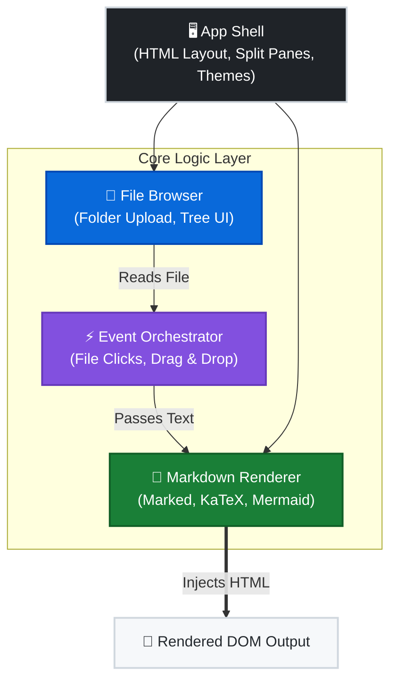

# 📑 MD Browser
# A Lightweight, Client‑Side Markdown Documentation Viewer Tool

  

A fully client‑side, zero‑backend Markdown viewer with a split‑pane layout:

- **Left pane:** Narrow TOC‑style file browser with collapsible folders
- **Right pane:** GitHub‑style Markdown renderer with Mermaid, KaTeX, dark mode, and drag‑and‑drop

This project is designed for developers, writers, and documentation engineers who want a fast, offline‑friendly Markdown previewer with modern rendering capabilities.

---

## 📋 Table of Contents
- [📑 MD Browser](#-md-browser)
- [A Lightweight, Client‑Side Markdown Documentation Viewer Tool](#a-lightweight-clientside-markdown-documentation-viewer-tool)
  - [📋 Table of Contents](#-table-of-contents)
  - [🚀 Getting Started](#-getting-started)
  - [✨ Features](#-features)
    - [🔍 File Browser (Left Pane)](#-file-browser-left-pane)
    - [📝 Markdown Renderer (Right Pane)](#-markdown-renderer-right-pane)
    - [🎨 UI \& UX](#-ui--ux)
  - [🤖 AI‑Generated Code Disclaimer](#-aigenerated-code-disclaimer)
  - [🧱 Architecture \& Flow Overview](#-architecture--flow-overview)
  - [📦 Module Descriptions](#-module-descriptions)
    - [🖥️ App Shell](#️-app-shell)
    - [📂 File Browser Module](#-file-browser-module)
    - [📝 Markdown Renderer Module](#-markdown-renderer-module)
    - [⚡ Event Orchestrator](#-event-orchestrator)
  - [🛠 Developer Onboarding](#-developer-onboarding)
    - [📐 Key Design Principles](#-key-design-principles)
    - [🔌 Recommended IDE Extensions](#-recommended-ide-extensions)
  - [🗺 Future Roadmap](#-future-roadmap)
    - [🔧 Core Enhancements](#-core-enhancements)
    - [🎨 UI/UX Improvements](#-uiux-improvements)
    - [🧩 Feature Extensions](#-feature-extensions)
    - [🌐 Advanced Integrations](#-advanced-integrations)
  - [🤝 Contributing](#-contributing)
  - [📄 License](#-license)

## 🚀 Getting Started
1. **Clone the repository**
   ```bash
   git clone https://github.com/yourname/MDBrowser.git
   ```
2. **Open the App**

   Double-click `md-browser.html` in your browser. *(No local server required!)*
3. **Start Browsing**

   Use the **Choose Files** button to load a folder, or simply **drag & drop** a `.md` file directly into the viewer.

## ✨ Features

### 🔍 File Browser (Left Pane)
- Upload entire folders using `webkitdirectory`
- Auto‑generated collapsible folder tree (supports infinite depth)
- Only `.md` files included
- Narrow TOC‑style layout for efficient navigation
- Click any file to render instantly

### 📝 Markdown Renderer (Right Pane)
- GitHub‑style Markdown theme (light + dark)
- Mermaid diagram rendering via ```mermaid``` blocks
- KaTeX math rendering (`$...$`, `$$...$$`)
- Line‑break friendly Markdown (`breaks: true`)
- Drag‑and‑drop `.md` file support
- Chrome‑yellow link color for visibility

### 🎨 UI & UX
- Dark mode toggle (default light)
- Single-button collapsible sidebar UI
- Fully offline capable with locally sourced dependencies (`ext/` folder)
- No build step, no server — works offline

## 🤖 AI‑Generated Code Disclaimer
This project is provided as a general‑purpose utility and is not certified for regulated, safety‑critical, or compliance‑bound environments.

> [!CAUTION]
> Parts of this project—including code, documentation, and architectural descriptions—were generated with the assistance of AI tools. While every effort has been made to ensure correctness, clarity, and originality, the following disclaimers apply:

- **No Guarantee of Exclusivity**: AI‑generated code may resemble publicly available code, patterns, or structures due to the nature of machine‑learned models. Any similarity to existing implementations is unintentional.
- **No Liability for IP Conflicts**: The contributors and maintainers of this project assume no responsibility or liability for any intellectual property conflicts, copyright claims, or licensing issues that may arise from AI‑generated content.
- **Developer Responsibility**: Users and contributors are encouraged to review, validate, and refactor the code as needed to ensure compliance with their own organizational, legal, or licensing requirements.
- **No Warranty**: This project is provided "as‑is" without warranty of any kind, express or implied, including but not limited to fitness for a particular purpose, non‑infringement, or merchantability. The maintainers provide no guarantees regarding suitability for enterprise, commercial, or mission‑critical use.

*By using or contributing to this project, you acknowledge and accept these conditions.*

## 🧱 Architecture & Flow Overview

The viewer is intentionally simple and modular. Everything runs in a single HTML file, but the logic is cleanly separated into conceptual modules to ensure maintainability and progressive enhancement.



## 📦 Module Descriptions
### 🖥️ App Shell
- **Structure**: Defines the split-pane layout and hosts the navigation bar.
- **Theming**: Manages global CSS variables for seamless light/dark mode toggling.
### 📂 File Browser Module
- **Ingestion**: Reads uploaded folders via `webkitdirectory` and filters for `.md` files.
- **UI**: Generates the interactive, infinitely-deep collapsible tree in the left pane.
### 📝 Markdown Renderer Module
- **Parsing**: Configures `marked` for Markdown and intercepts `mermaid` blocks.
- **Rendering**: Coordinates KaTeX math and Mermaid diagram generation safely in the DOM.
### ⚡ Event Orchestrator
- **Interactions**: Handles file clicks, drag-and-drops, and theme toggling.
- **Pipeline**: Enforces the rendering order (**Markdown → KaTeX → Mermaid**).
- **Live Preview**: Polls active files and instantly reflects local saves in the viewer.

## 🛠 Developer Onboarding
This project is intentionally built for maximum readability and hackability.
### 📐 Key Design Principles
- **Zero Build Tools**: No webpack, no npm scripts. Everything runs natively in the browser.
- **Client-Side Only**: Easy to copy, embed, or extend without a backend server.
- **Progressive Enhancement**: Features are layered modularly without framework complexity.
- **Comment-Rich**: Code is extensively documented to help new contributors ramp up instantly.
### 🔌 Recommended IDE Extensions
- **VSCode + Markdown All-in-One**: For an optimal Markdown editing experience.
- **Prettier**: For consistent HTML/CSS/JS formatting across the codebase.

## 🗺 Future Roadmap
### 🔧 Core Enhancements
- [ ] Add search bar to filter files in the sidebar
- [ ] Add keyboard navigation for power users
- [ ] Add "Open Recent" memory and persistent dark mode (via `localStorage`)
### 🎨 UI/UX Improvements
- [ ] Resizable split panes
- [ ] Breadcrumb navigation above the viewer
- [ ] File/Folder icons in the file tree
### 🧩 Feature Extensions
- [x] **Live Preview Mode**: Auto-refresh viewer on local file save
- [ ] Built-in Markdown Editor (Monaco/CodeMirror integration)
- [ ] Export to HTML/PDF (client-side generation)
- [ ] Plugin system for custom markdown renderers
### 🌐 Advanced Integrations
- [ ] GitHub Repo Loader (fetch Markdown directly from public repos)
- [ ] URL hash routing (`?file=...`) for deep linking
- [ ] Service worker for true offline PWA caching

## 🤝 Contributing
Contributions are always welcome!
1. Fork the repo
2. Create a feature branch
3. Submit a PR with a clear description
4. Ensure your code is well‑commented and adheres to the progressive enhancement design philosophy.

## 📄 License
MIT License — free to use, modify, and distribute.